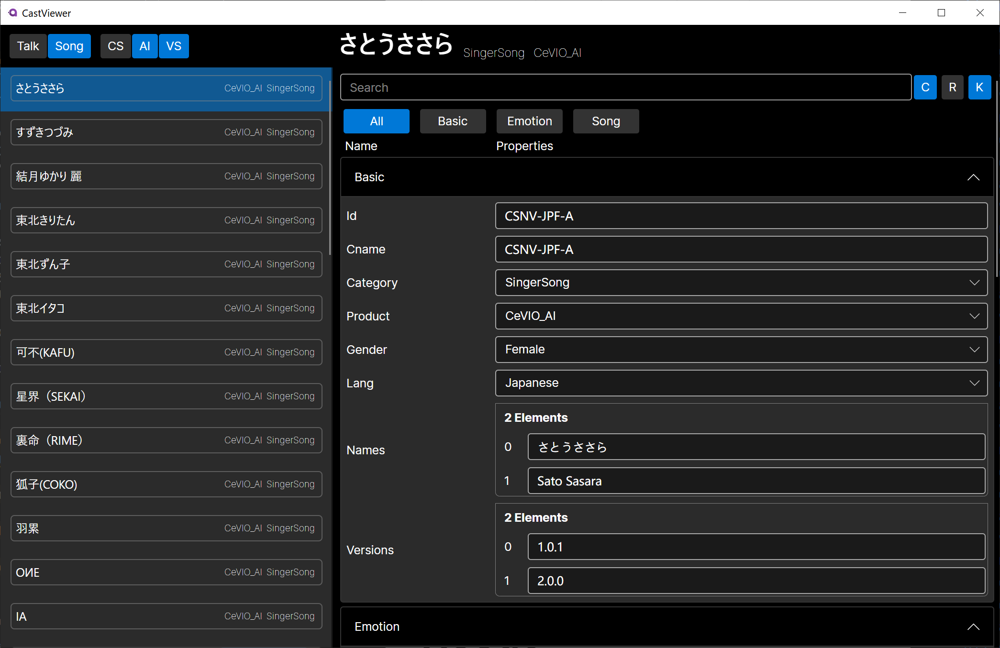
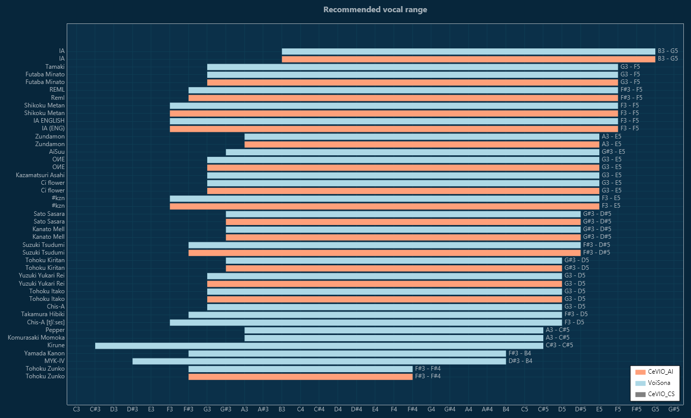
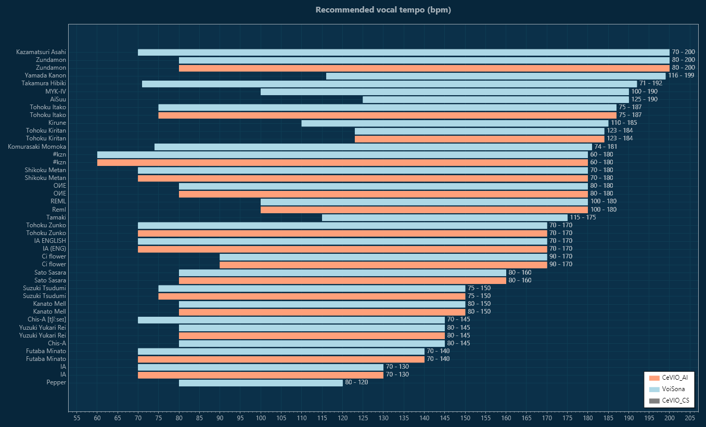

# cevio-casts

JSON形式で定義されたCeVIOのキャスト（ボイスライブラリ）の定義データです。

Definition data for CeVIO casts (voice library) defined in JSON format.

----

[](LICENSE)
  
[](https://cevio.jp/) [](https://cevio.jp/) [](https://voisona.com/) [](https://voisona.com/talk/)

# Features

- CeVIO / VoiSona のキャスト（ボイスライブラリ）の情報を定義したデータです
  - json形式で提供しています
  - ライブラリごとのバージョン情報データを含みます
- 【ソング】特殊歌詞記号のデータも含まれます
- 【ソング】推奨音域・推奨テンポの情報を含みます（v1.21.0以降）
- キャスト名・感情名・歌詞特殊記号(ソング)は日本語表記の他、英語表記の定義も含まれます
- CeVIOトークの外部連携インターフェイスを経由せずにキャスト（ボイスライブラリ）の名前やIDを取得できます
- CeVIOトークボイスの感情パラメータの名前やIDも同様に静的に取得できます
- CeVIOソングボイス/VoiSonaソングボイスライブラリの内部IDも静的に取得できます
- 多言語対応ボイスライブラリはベースの言語が記録されています

| Product  | Talk | Song | Total |
|----------|-----:|-----:|------:|
| CeVIO CS |    5 |   11 |    16 |
| CeVIO AI |   16 |   27 |    43 |
| VoiSona  |   19 |   41 |    60 |
| Sum      |   40 |   79 |   119 |

## Definitions

- Cast names (JP/partially EN)
- Cast internal ID
  - CeVIO CSの一部キャストIDはトークとソングで共通の文字列で、ユニークではありません。そこで独自のIDを降っています。
  - The IDs of some of the casts in CeVIO CS are common strings for talks and songs and are not unique. Therefore, we are raining unique IDs.
- Cast internal names in ccs/ccst/tssprj/tstprj

## CastViewer



|||
|---|---|
|vocal range plot|vocal tempo plot|

https://inuinu2022.github.io/cevio-casts/

- cast-dataを見ることができるアプリです
- **「Plot」タブ**
  - ボイスライブラリの推奨テンポ・推奨音域・テンポ＆音域の広さ・感情数のグラフをみることができます
  - ※トークボイスも含まれます
  - ※グラフはマウス操作で拡大縮小できます（中クリックでリセット）
- **「Table」タブ**
  - ボイスライブラリの感情（スタイル）や特殊記号を表で見ることができます
  - ※トークボイスも含まれます
- **「Data」タブ** (Desktop版のみ)
  - ボイスライブラリの詳細なデータを見ることができます
  - 一応ソフト・ソングorトークでフィルタできます
- Desktop版とWeb（Wasm）版のみ動きます
  - Web（Wasm）版は「Data」タブが正しく動きません

- [License](viewer/CastViewer/License/)

# Requirement

* json-schema draft-07

# Usage


## data

[github releases](https://github.com/InuInu2022/cevio-casts/releases)に最新の定義データ **`data.json`** をアップロードしていますのでダウンロードして使ってください。

**[./data/data.json](./data/data.json)** に最新の定義データがあるので動的にDLするのでも構いません。※githubからのDLはgithubのDL制限に引っかからないように注意してください。

`https://raw.githubusercontent.com/InuInu2022/cevio-casts/main/data/data.json`

## json schema

json schemaは `model/schema.json` にあります。
`casts.ts`というTypeScriptの定義ファイルから自動生成しています。

```node
npm run makeschema
```

で生成できます。

## example: C-Sharp

生成済みのヘルパークラス `Definitions.cs` と、クラスライブラリプロジェクト `CevioCasts` があります。

`Definitions.cs`は、quicktypeで自動生成したコードを元に、修正しています。

`gen-csharp.js` で生成できます。

git submoduleで`CevioCasts`を直接取り込んでも良いですし、`Definitions.cs`をコピーしても構いません。

```csharp
using CevioCasts; //if you included classlib `CevioCasts`

var jsonString = File.ReadAllText("path/to/data.json");
var defs = Definitions.FromJson(jsonString);
```

### sample code: SongAlphaValueCheck

[SongAlphaValueCheck
/Program.cs](https://github.com/InuInu2022/CeVIOVoiceLibDB/blob/main/tools/SongAlphaValueCheck/Program.cs)

### Update check from GitHub releases

`CevioCasts.UpdateChecker.GithubRelease`を使うと
github releaseの最新のバージョンのcast-dataの確認やダウンロードができます。

```cs
using CevioCasts.UpdateChecker;

var gr = await GithubRelease
  .BuildAsync("path/to/local/data.json");

var localVersion = gr.GetLocalVersion();
var latestVersion = await gr.GetRepositoryVersionAsync();

var isAvailable = await gr.IsAvailableAsync();

await gr.DownloadAsync();
```

## other language

quicktypeを利用して各言語のヘルパーコードを生成するのがおすすめです。

```cmd
quicktype ../data/data.json -o csharp/CevioCasts/Definitions.cs -l csharp --namespace CevioCasts --features complete -S ../model/schema.json
```

# Note

CeVIO Creative Studio の ONE (Song/Talk), IA (English Song/Talk)のデータが不十分です。
協力してくださる方を募集中です。

## 🐶Author

- InuInu（いぬいぬ）
  - YouTube [YouTube](https://bit.ly/InuInuMusic)
  - Twitter [@InuInuGames](https://twitter.com/InuInuGames)
  - Blog [note.com](https://note.com/inuinu_)
  - niconico [niconico](https://nico.ms/user/98013232)

# License

"cavio-casts" is under [MIT license](https://en.wikipedia.org/wiki/MIT_License).

```
MIT License

Copyright (c) 2024-2026 いぬいぬ
```
