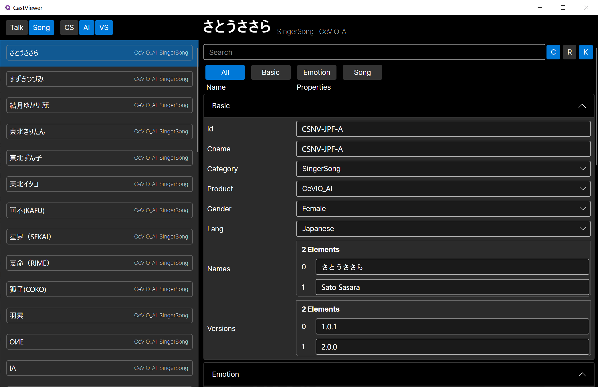
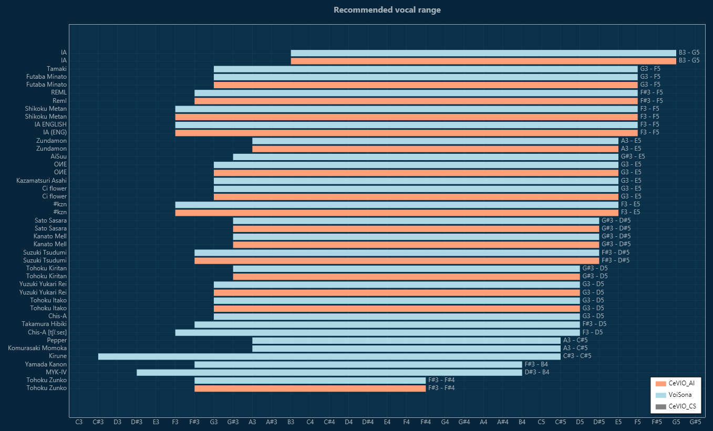
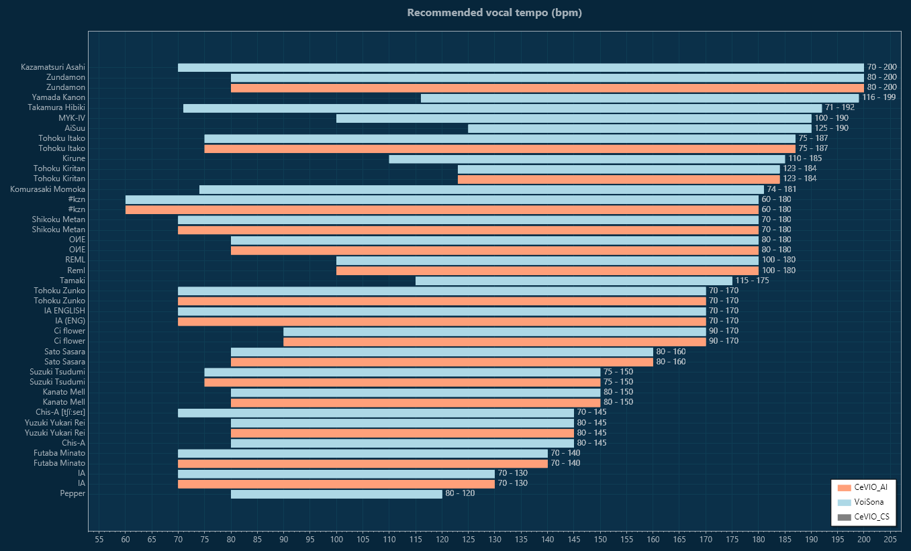

# cevio-casts

JSON形式で定義されたCeVIOのキャスト（ボイスライブラリ）の定義データです。

Definition data for CeVIO casts (voice library) defined in JSON format.

----

[](LICENSE)
  
[](https://cevio.jp/) [](https://cevio.jp/) [](https://voisona.com/) [](https://voisona.com/talk/)


# Features

- CeVIO / VoiSona のキャスト（ボイスライブラリ）の情報を定義したデータです
  - json形式で提供しています
  - ライブラリごとのバージョン情報データを含みます
- 【ソング】特殊歌詞記号のデータも含まれます
- 【ソング】推奨音域・推奨テンポの情報を含みます（v1.21.0以降）
- キャスト名・感情名・歌詞特殊記号(ソング)は日本語表記の他、英語表記の定義も含まれます
- CeVIOトークの外部連携インターフェイスを経由せずにキャスト（ボイスライブラリ）の名前やIDを取得できます
- CeVIOトークボイスの感情パラメータの名前やIDも同様に静的に取得できます
- CeVIOソングボイス/VoiSonaソングボイスライブラリの内部IDも静的に取得できます

|Product|Talk|Song|Total|
|---|---:|---:|---:|
|CeVIO CS|5|11|16|
|CeVIO AI|14|23|37|
|VoiSona|11|28|39|
|Sum|30|62|92|

## Definitions

- Cast names (JP/partially EN)
- Cast internal ID
  - CeVIO CSの一部キャストIDはトークとソングで共通の文字列で、ユニークではありません。そこで独自のIDを降っています。
  - The IDs of some of the casts in CeVIO CS are common strings for talks and songs and are not unique. Therefore, we are raining unique IDs.
- Cast internal names in ccs/ccst/tssprj/tstprj

## CastViewer



|||
|---|---|
|vocal range plot|vocal tempo plot|

WIP

- cast-dataを見ることができるアプリです
- Desktop版とWasm版のみ動きます
- .NET SDKを入れた状態で `dotnet run` してください

- [License](viewer/CastViewer/License/)

# Requirement

* json-schema draft-07

# Usage


## data

[github releases](https://github.com/InuInu2022/cevio-casts/releases)に最新の定義データ **`data.json`** をアップロードしていますのでダウンロードして使ってください。

**[./data/data.json](./data/data.json)** に最新の定義データがあるので動的にDLするのでも構いません。※githubからのDLはgithubのDL制限に引っかからないように注意してください。

`https://raw.githubusercontent.com/InuInu2022/cevio-casts/main/data/data.json`

## json schema

json schemaは `model/schema.json` にあります。
`casts.ts`というTypeScriptの定義ファイルから自動生成しています。

```node
npm run makeschema
```

で生成できます。

## example: C-Sharp

生成済みのヘルパークラス `Definitions.cs` と、クラスライブラリプロジェクト `CevioCasts` があります。

`Definitions.cs`は、quicktypeで自動生成したコードを元に、修正しています。

`gen-csharp.js` で生成できます。

git submoduleで`CevioCasts`を直接取り込んでも良いですし、`Definitions.cs`をコピーしても構いません。

```csharp
using CevioCasts; //if you included classlib `CevioCasts`

var jsonString = File.ReadAllText("path/to/data.json");
var defs = Definitions.FromJson(jsonString);
```

### sample code: SongAlphaValueCheck

[SongAlphaValueCheck
/Program.cs](https://github.com/InuInu2022/CeVIOVoiceLibDB/blob/main/tools/SongAlphaValueCheck/Program.cs)

### Update check from GitHub releases

`CevioCasts.UpdateChecker.GithubRelease`を使うと
github releaseの最新のバージョンのcast-dataの確認やダウンロードができます。

```cs
using CevioCasts.UpdateChecker;

var gr = await GithubRelease
  .BuildAsync("path/to/local/data.json");

var localVersion = gr.GetLocalVersion();
var latestVersion = await gr.GetRepositoryVersionAsync();

var isAvailable = await gr.IsAvailableAsync();

await gr.DownloadAsync();
```

## other language

quicktypeを利用して各言語のヘルパーコードを生成するのがおすすめです。

```cmd
quicktype ../data/data.json -o csharp/CevioCasts/Definitions.cs -l csharp --namespace CevioCasts --features complete -S ../model/schema.json
```

# Note

CeVIO Creative Studio の ONE (Song/Talk), IA (English Song/Talk)のデータが不十分です。
協力してくださる方を募集中です。

## 🐶Author

- InuInu（いぬいぬ）
  - YouTube [YouTube](https://bit.ly/InuInuMusic)
  - Twitter [@InuInuGames](https://twitter.com/InuInuGames)
  - Blog [note.com](https://note.com/inuinu_)
  - niconico [niconico](https://nico.ms/user/98013232)

# License

"cavio-casts" is under [MIT license](https://en.wikipedia.org/wiki/MIT_License).

```
MIT License

Copyright (c) 2024 いぬいぬ
```
